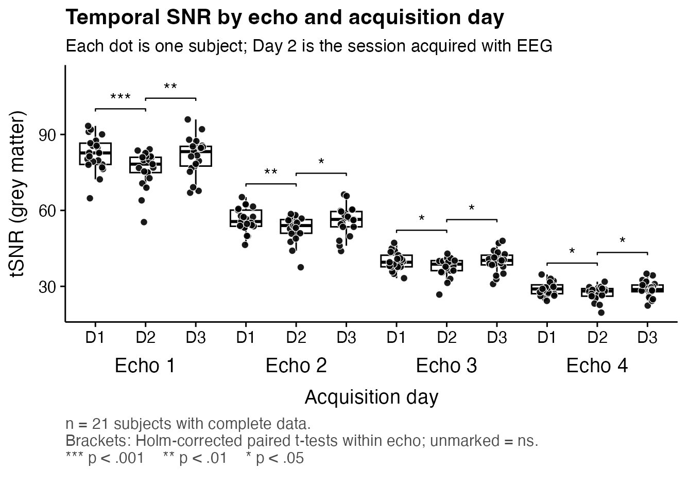
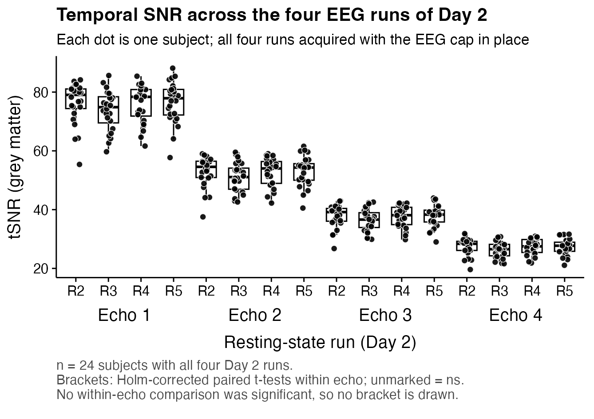
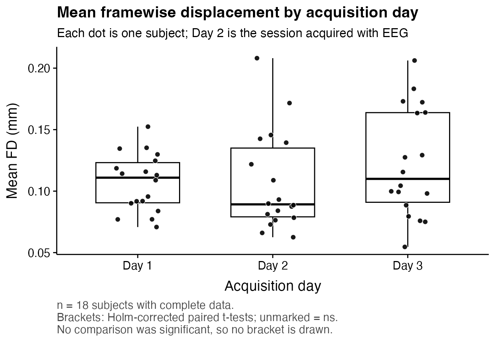
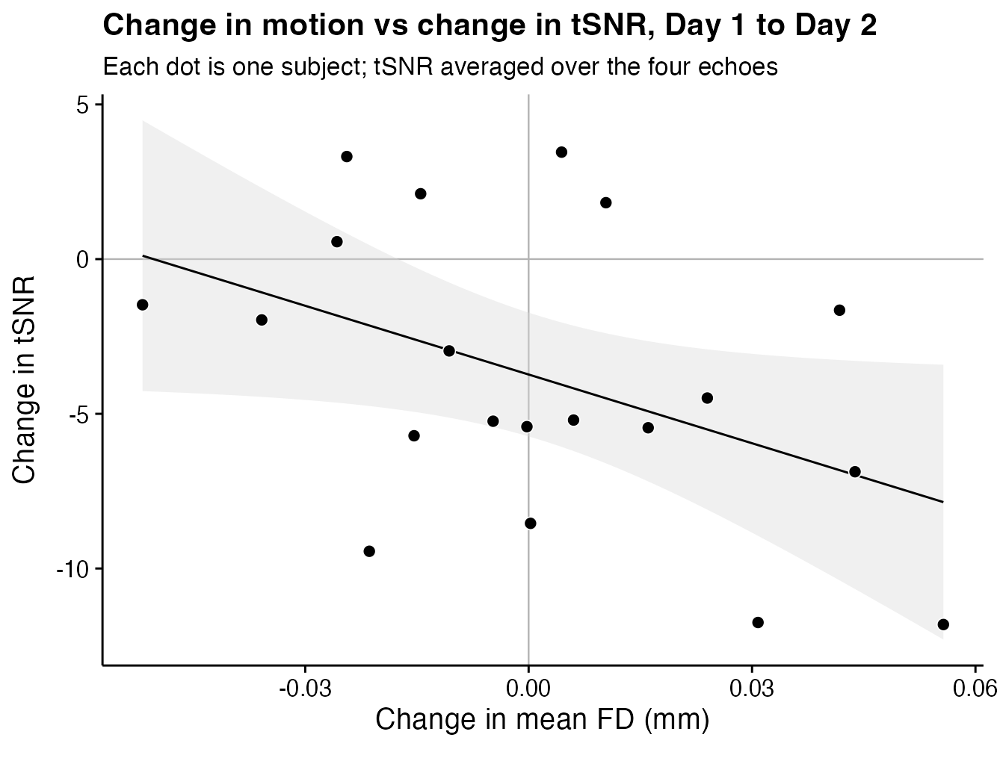

# tSNR and head motion across three sessions, with and without EEG

Quality-control results for the EEG-fMRI extinction study. Three resting-state
sessions were acquired per subject on separate days with a multi-echo sequence
(`acq-mb3me4`, 4 echoes). **Day 2 is the session acquired with the EEG cap in
place**; Days 1 and 3 are without EEG. The question is whether the EEG hardware
costs image quality, and if so, how.

| Run | Session | EEG | Used in |
|-----|---------|-----|---------|
| 1 | `ses-Day1_task-rest1` | no  | across-day comparison |
| 2 | `ses-Day2_task-rest2` | **yes** | across-day comparison + within-Day-2 |
| 3 | `ses-Day2_task-rest3` | **yes** | within-Day-2 |
| 4 | `ses-Day2_task-rest4` | **yes** | within-Day-2 |
| 5 | `ses-Day2_task-rest5` | **yes** | within-Day-2 |
| 6 | `ses-Day3_task-rest6` | no  | across-day comparison |

Two measures: **tSNR**, the mean of the voxelwise temporal-SNR map inside each
subject's grey-matter mask, one value per subject × run × echo; and **framewise
displacement (FD)**, one value per subject × run (motion is estimated once per
BOLD series, so there is no echo dimension).

All tests are fully within-subject repeated-measures ANOVAs on complete cases,
with Greenhouse-Geisser correction applied automatically where Mauchly's test
indicates a sphericity violation. Post-hoc tests are paired *t*-tests with Holm
correction. `ges` is generalised eta-squared.

---

## 1. tSNR across the three days (first scan of each day)

Runs 1, 2 and 6 — the first resting-state scan of each day — in a day × echo
ANOVA. **n = 21 of 25** subjects have all 12 cells.



### Echo dominates, as expected

tSNR falls monotonically with echo number: 80.1, 55.1, 39.2, 28.4
(*F*(1.07, 21.31) = 3427.89, *p* < .001, ges = .940). This is ordinary T2\*
decay — later echoes have longer TE, so less signal remains while thermal noise
stays roughly constant. It is a property of the sequence, not a data-quality
finding.

### Day 2, the EEG session, loses ~6% of its tSNR

Collapsed across echoes, mean tSNR is 51.9 (Day 1), 48.6 (Day 2), 51.6 (Day 3)
— **a significant effect of day (*F*(2, 40) = 6.80, *p* = .003, ges = .083)**.
The post-hoc pattern is unambiguous and is what the brackets in the figure show:

| Comparison | Statistic | *p*<sub>adj</sub> | |
|---|---|---|---|
| Day 1 vs Day 2 | *t*(20) = 3.69 | **.004** | Day 2 lower |
| Day 2 vs Day 3 | *t*(20) = −3.03 | **.013** | Day 2 lower |
| Day 1 vs Day 3 | *t*(20) = 0.29 | .775 | no difference |

Day 2 is **6.0%** below the mean of the two non-EEG days. The two non-EEG days
are statistically indistinguishable and differ by at most 1.1% in any echo, so
this is not session-order drift or scanner instability — it tracks the EEG cap,
and it fully reverses on Day 3.

The loss is present in **every echo**; all eight Day-2 contrasts survive Holm
correction, while no Day 1 vs Day 3 contrast does:

| Echo | Day 1 vs Day 2 | Day 2 vs Day 3 | Day 2 vs Day 1 (%) |
|---|---|---|---|
| 1 | *t*(20) = 4.33, *p*<sub>adj</sub> < .001 \*\*\* | *t*(20) = −3.41, *p*<sub>adj</sub> = .006 \*\* | −7.2% |
| 2 | *t*(20) = 3.39, *p*<sub>adj</sub> = .009 \*\* | *t*(20) = −2.75, *p*<sub>adj</sub> = .025 \* | −5.9% |
| 3 | *t*(20) = 2.99, *p*<sub>adj</sub> = .022 \* | *t*(20) = −2.65, *p*<sub>adj</sub> = .030 \* | −5.4% |
| 4 | *t*(20) = 3.13, *p*<sub>adj</sub> = .016 \* | *t*(20) = −2.83, *p*<sub>adj</sub> = .021 \* | −5.7% |

### The day × echo interaction is a scaling artefact, not a TE-specific effect

In raw units the interaction is significant
(*F*(2.16, 43.16) = 11.71, *p* < .001, ges = .021), but **on `log(tSNR)` it
disappears** (*F*(1.84, 36.74) = 2.51, *p* = .100, ges = .001) while the day
main effect survives (*F*(2, 40) = 6.11, *p* = .005). Echo 1 sits on a
three-times-larger scale than echo 4, so an equal *proportional* loss shows up
as an interaction in absolute units. This matters for interpretation: the EEG
cost is a **constant relative loss of about 6% at every TE**, not a loss that
grows with echo time.

---

## 2. tSNR across the four EEG runs of Day 2

Runs 2–5, all acquired with the cap on, in a run × echo ANOVA. **n = 24 of 24**
subjects have all 16 cells.



**No effect of run.** Mean tSNR is 48.6, 46.9, 48.4, 48.7 across rest2–rest5
(*F*(3, 69) = 1.96, *p* = .127, ges = .023), with no run × echo interaction
(*F*(2.31, 53.15) = 1.71, *p* = .186, ges = .003). Echo again dominates
(*F*(1.06, 24.31) = 4064.52, *p* < .001, ges = .935).

No post-hoc comparison survives correction — neither collapsed across echoes
(smallest *p*<sub>adj</sub> = .163) nor within any echo (**0 of 24** contrasts),
which is why this figure carries no significance brackets. Rest3 is nominally
the lowest run (~3.5% below rest2 in every echo) but rest4 and rest5 return to
the rest2 level, so this is noise rather than a trend.

**Interpretation:** the EEG penalty is present at full size in the very first
EEG run and stays flat for the rest of the session. The cost is attached to
*having the cap on*, not to how long it has been on. This rules out progressive
mechanisms — gel drying, cap heating, subject fatigue or growing discomfort.

---

## 3. Head motion (mean FD)

If subjects simply moved more while wearing the cap, that alone could lower
tSNR. It does not happen.



### Across days: no effect that holds up

Mean FD is 0.107 mm (Day 1), 0.107 mm (Day 2), 0.123 mm (Day 3). The ANOVA is
*nominally* significant (*F*(2, 34) = 3.82, *p* = .032, ges = .042, n = 18) but
the result does not survive scrutiny:

- **no post-hoc comparison survives** Holm correction (smallest
  *p*<sub>adj</sub> = .065, for Day 1 vs Day 3);
- **Friedman's rank-based test is null** (χ²(2) = 3.11, *p* = .211, Kendall's
  *W* = .086, small);
- the effect drops to *p* = .065 on the log scale.

Critically, what little signal there is comes from **Day 3** being ~15% higher
than Day 1, *not* from the EEG day. Day 1 vs Day 2 is as close to nothing as a
comparison gets (*t*(17) = 0.06, *p*<sub>adj</sub> = .956).

### Within Day 2: no drift across the EEG runs

Mean FD declines slightly and monotonically after the first run — 0.102, 0.106,
0.099, 0.092 mm — but the ANOVA is null (*F*(1.78, 35.64) = 2.19, *p* = .132,
ges = .025), Friedman is null (χ²(3) = 7.11, *p* = .068, *W* = .113), and no
post-hoc survives (smallest *p*<sub>adj</sub> = .113). No evidence that subjects
settle or deteriorate over the EEG session.

### Max FD: null everywhere

Across days *F*(1.24, 21) = 1.45, *p* = .249 (Friedman χ²(2) = 2.11, *p* =
.348); within Day 2 *F*(1.74, 34.78) = 0.40, *p* = .648 (Friedman χ²(3) = 3.51,
*p* = .319). Note that max FD is the largest of ~330 values and its paired
differences are strongly non-normal (Shapiro-Wilk *p* down to 1.1 × 10⁻⁵), so
for this variable the rank-based tests are the primary ones. They agree.

**In total, 0 of 36 FD post-hoc comparisons survive Holm correction.** Head
motion is statistically indistinguishable across days and across the Day 2 runs.

---

## 4. Relationship between tSNR change and FD change

Motion does not cause the Day 2 tSNR drop, but it is not irrelevant either —
these are two different questions, and the answers differ.



Per subject, from Day 1 to Day 2 (n = 20 with both measures, tSNR averaged over
the four echoes):

**Motion predicts *which* subjects lost more tSNR.** The two changes correlate
in the expected direction (Spearman *rho* = −0.41, *p* = .075), and in the
regression the slope is significant: *b* = −74.1 tSNR units per mm of FD
(*p* = .047, R² = .20). Subjects who moved more on Day 2 did lose more tSNR, so
motion is a genuine contributor to the subject-to-subject **spread** of the
effect.

**Motion does not cause the loss itself.** The regression intercept — the
expected tSNR change for a subject whose motion was identical on both days — is
**−3.73 (*p* = .001)**, against a raw mean change of −3.84
(*t*(19) = −3.70, *p* = .002). Essentially the entire mean drop remains at zero
motion change. That has to be so: group mean FD was flat, and only 10 of 20
subjects moved more on Day 2 at all, so motion has no mean shift available to
transmit to tSNR.

Two caveats specific to this section: n = 20 is small for a correlation, so the
slope is imprecise; and FD and tSNR are not independent measurements, since
motion enters tSNR directly through the temporal standard deviation.

---

## Conclusion: what might change tSNR when EEG is in the bore

The EEG session costs about **6% of grey-matter tSNR**, and the *pattern* of that
loss constrains the mechanism more tightly than its size does. Four features are
diagnostic:

1. **It is a constant proportional loss at every echo** — the day × echo
   interaction vanishes on the log scale (*p* = .100).
2. **It appears at full size in the first EEG run and does not drift** over the
   four Day-2 runs (*p* = .127).
3. **It fully reverses on Day 3** (Day 1 vs Day 3, *p*<sub>adj</sub> = .775).
4. **It is not driven by head motion** (group FD flat; regression intercept
   −3.73, *p* = .001).

### Mechanisms consistent with this pattern

- **Reduced RF receive sensitivity from coil loading.** The conductive cap,
  electrodes, gel and lead bundle sit between the head and the receive array and
  add a resistive/dielectric load, lowering coil Q and receive sensitivity.
  Sensitivity is TE-independent, so the signal at every echo is scaled by the
  same factor and tSNR drops by the same *relative* amount everywhere. This fits
  all four features and is the best-supported explanation.
- **A proportional increase in noise** — from lead-borne interference, or
  vibration of the leads during gradient switching coupling into the readout.
  Any noise source that scales with signal produces the same uniform relative
  loss. The slightly larger relative loss at echo 1 (−7.2%) than echo 4 (−5.7%),
  though not significant on the log scale, leans mildly this way rather than
  toward a fixed additive noise floor.

### Mechanisms the data argue against

- **Susceptibility / T2\* shortening from the electrodes.** Local B0 distortion
  would cost proportionally *more* at longer TE, so the relative loss should grow
  from echo 1 to echo 4. The observed trend is flat, if anything slightly the
  opposite. Electrode-induced dropout is therefore not the main driver of the
  global effect (it may still exist locally under electrodes — see below).
- **Head motion.** Ruled out above.
- **Progressive within-session effects** — gel drying, cap heating, subject
  discomfort or fatigue. Ruled out by the flat run effect across rest2–rest5.
- **Scanner drift or session-order effects.** Ruled out by Day 3 returning to
  the Day 1 level.

### What this means practically

- **Do not pool resting-state runs across days without accounting for session.**
  A systematic 6% tSNR difference between the EEG day and the non-EEG days will
  propagate into any between-session comparison of effect sizes or variance.
  Include session as a covariate, or restrict within-subject contrasts to runs
  from the same day.
- **Echo weighting for the multi-echo combination can use the same weights on
  every day.** The loss is proportional across echoes, so the relative weighting
  is unchanged — this is a direct consequence of the log-scale result.
- **If Day 2 tSNR is used as a per-subject covariate, carry mean FD alongside
  it,** since motion explains ~20% of the variance in the per-subject loss.

### How to test the mechanism directly

The attribution above is inference from the pattern of the loss, not a
measurement of coil loading or noise. Two cheap acquisitions would settle it:

1. **Noise-only volumes (RF excitation off), with and without the cap.** This
   separates a *drop in signal* (receive sensitivity) from a *rise in noise*
   (interference, lead vibration) — the two mechanisms above that the current
   data cannot distinguish.
2. **A phantom scan with and without the cap**, which removes motion and
   physiology entirely and gives a clean estimate of the hardware cost.

Additionally, a **voxelwise or ROI analysis** of the existing tSNR maps would
show *where* the loss sits, which also discriminates: coil loading predicts the
largest loss in superficial cortex nearest the electrodes with deep structures
relatively spared, whereas a global sensitivity change predicts a more uniform
drop. Fit the model on `log(tSNR)` so a uniform relative loss appears as a
uniform additive shift, and prefer a non-parametric test — tSNR maps are smooth
and heavy-tailed.

---

## Files

| File | Contents |
|---|---|
| [`tSNR_results.Rmd`](tSNR_results.Rmd) / `.html` | Full tSNR analysis, both parts |
| [`fd_results.Rmd`](fd_results.Rmd) / `.html` | Full FD analysis, mean and max, both parts |
| [`qc_plot_helpers.R`](qc_plot_helpers.R) | Shared plotting code and significance-bracket logic |
| [`extract_fd.py`](extract_fd.py) | Builds `fd_results.csv` from fMRIPrep confounds files |
| `tSNR_results.txt`, `tSNR_qc.csv` | tSNR input tables (wide and long) |
| `fd_results.csv` | FD input table (long) |
| `figures/` | PNG figures used in this summary |
| `eeg_fmri_ext_SNR_1_v2.m`, `eeg_fmri_ext_SNR_2_v2.sh` | Preprocessing and tSNR computation |

Reproduce with:

```r
rmarkdown::render("tSNR_results.Rmd")
rmarkdown::render("fd_results.Rmd")
```

```bash
python3 extract_fd.py /path/to/fmriprep -o fd_results.csv
```
